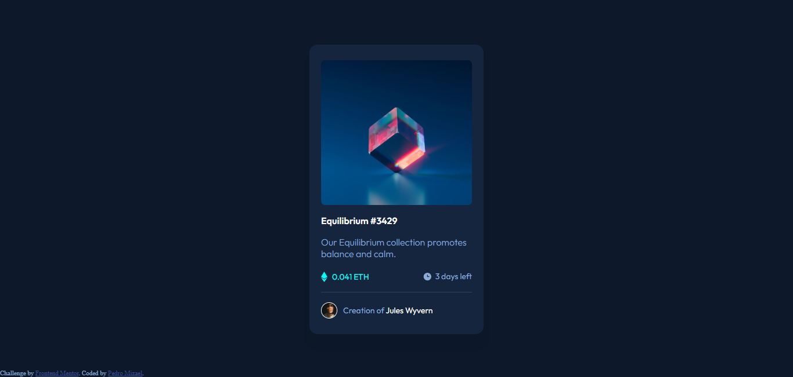

# Frontend Mentor - Product preview card component solution

This is a solution to the [Product preview card component challenge on Frontend Mentor](https://www.frontendmentor.io/challenges/product-preview-card-component-GO7UmttRfa). Frontend Mentor challenges help you improve your coding skills by building realistic projects. 

## Table of contents

- [Overview](#overview)
  - [The challenge](#the-challenge)
  - [Screenshot](#screenshot)
  - [Links](#links)
- [My process](#my-process)
  - [Built with](#built-with)
  - [What I learned](#what-i-learned)
- [Author](#author)

## Overview

### The challenge

Usuários poderão:

- Ter um layout para Desktop e Mobile.
- Ver efeitos "hover" de elementos interativos.

### Screenshot

### Links

- Solution URL: [Github](https://github.com/pedro-mizael/HTML-and-CSS-product-preview-card
)
- Live Site URL: [Site](https://pedro-mizael.github.io/HTML-and-CSS-product-preview-card/)

## My process

### Built with

- Semantic HTML5 markup
- CSS custom properties
- Flexbox

### What I learned

Com este projeto pude aprender mais sobre o Display Flexbox,
explorar seu comportamento e seus casos de uso em um projeto real.
Foi um desafio que me ajudou a melhorar o tempo que levo para projetos simples,
praticando e explorando o Flexbox

## Author

- Website - [Pedro Mizael](https://pedro-mizael.github.io/portfolio-pedro-mizael/)
- Frontend Mentor - [@pedro-mizael](https://www.frontendmentor.io/profile/pedro-mizael)
- Instagram - [@pedromizael.web](https://www.instagram.com/pedromizael.web/)
